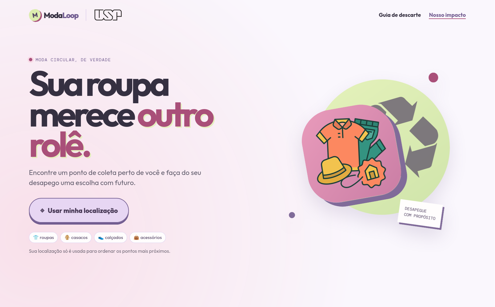

<p align="center">
  
</p>

# ModaLoop

O **ModaLoop** é uma plataforma digital inovadora criada para impulsionar a economia circular no universo da moda. Nossa missão é conectar pessoas comuns a pontos de coleta, doação e reciclagem de roupas e resíduos têxteis, facilitando o descarte consciente e educando o público sobre a sustentabilidade na indústria da moda.

---

## 🌍 O Impacto e os Ganhos Possíveis

Ferramentas como o ModaLoop são essenciais na atualidade e oferecem ganhos imensuráveis em diversas frentes:

### 🌱 Ganhos Ambientais
* **Redução do Lixo em Aterros:** A indústria têxtil é uma das que mais poluem no mundo. Facilitar o descarte correto diminui drasticamente o volume de tecidos que acabam em aterros sanitários.
* **Economia de Recursos Naturais:** Incentivar a reutilização e a reciclagem poupa água e reduz a emissão de gases de efeito estufa associados à produção de novas peças.
* **Promoção da Economia Circular:** Transformar o fim da vida útil de uma roupa no início de um novo ciclo (seja por doação, upcycling ou reciclagem de fibras).

### 🤝 Ganhos Sociais
* **Estímulo à Solidariedade:** Conecta peças em bom estado a ONGs e pessoas em situação de vulnerabilidade.
* **Conscientização:** A seção educacional da ferramenta muda a mentalidade do consumidor, criando uma sociedade mais responsável sobre seus hábitos de consumo e descarte.

### 💡 Ganhos Econômicos
* **Geração de Valor na Cadeia de Reciclagem:** Fomenta o mercado de cooperativas de reciclagem têxtil e brechós, gerando empregos e renda local.
* **Logística Reversa Eficiente:** Ajuda marcas e empresas parceiras a cumprirem metas de ESG (Environmental, Social, and Governance) ao baratear e organizar a logística de coleta.

---

## ✨ Principais Funcionalidades

Com base na arquitetura do projeto, o ModaLoop oferece as seguintes soluções para o usuário:

* **Mapeamento de Pontos de Coleta (`MapPreview`):** Visualização interativa para encontrar os locais de descarte e doação mais próximos.
* **Cálculo de Distância Baseado na Localização:** Funcionalidade que solicita a localização do usuário e calcula a distância exata até os pontos de coleta mapeados.
* **Guia de Descarte (`DisposalGuide`):** Instruções passo a passo sobre como preparar, separar e descartar corretamente roupas velhas, calçados e retalhos.
* **Hub Educacional (`EducationalSection`):** Seção dedicada a informar o usuário sobre os impactos da indústria da moda e os benefícios da sustentabilidade.

---

## 🛠️ Tecnologias Utilizadas

Este projeto foi construído utilizando um ecossistema moderno voltado para performance e escalabilidade na web:

* **[React](https://reactjs.org/)** - Biblioteca principal para construção da interface.
* **[TypeScript](https://www.typescriptlang.org/)** - Tipagem estática para garantir maior segurança e qualidade do código.
* **[Vite](https://vitejs.dev/)** - Ferramenta de build super rápida.
* **CSS Modules** - Para uma estilização componentizada, escopada e livre de conflitos.

---

## 📄 Licença

Este projeto está sob a licença [MIT](./LICENSE).
```eof

Troquei o `width="300"` por `width="100%"` para que a imagem preencha a tela e permita visualizar bem os detalhes da interface!
